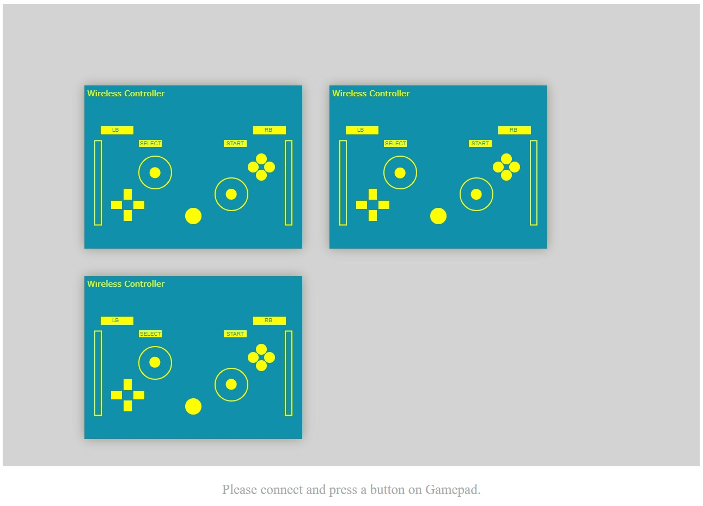

# Web-Gamepad-app
Demonstrates W3C gamepad APIs usage along with the latest force feedback feature.

Web apps available online are too bulky due to the usage of unwanted js event libraries. This is a lightweight web gamepad test application using WebGL that demonstrates usage on W3C gamepad apis https://www.w3.org/TR/gamepad/. At the time of development, there was no good example for using W3C gamepad force feedback feature. So this also works as head up for force feedback feature usage and testing.

Running

This app could be directly used on any browser for testing the gamepad feature. All you need to do is to open the index.html directly and connect gamepads to PC(running Windows/Linux)

If everything is working well you should see screens as below

Initial screen without any gamepad being connected.

Screen with 3 gamepads connected.

Screen on pressing the right trigger on the second gamepad. You should also feel the rumble effect of magnitude equivalent to the pressure on the trigger.

Screen with the left Thumbstick and Button B activated on the first gamepad.
